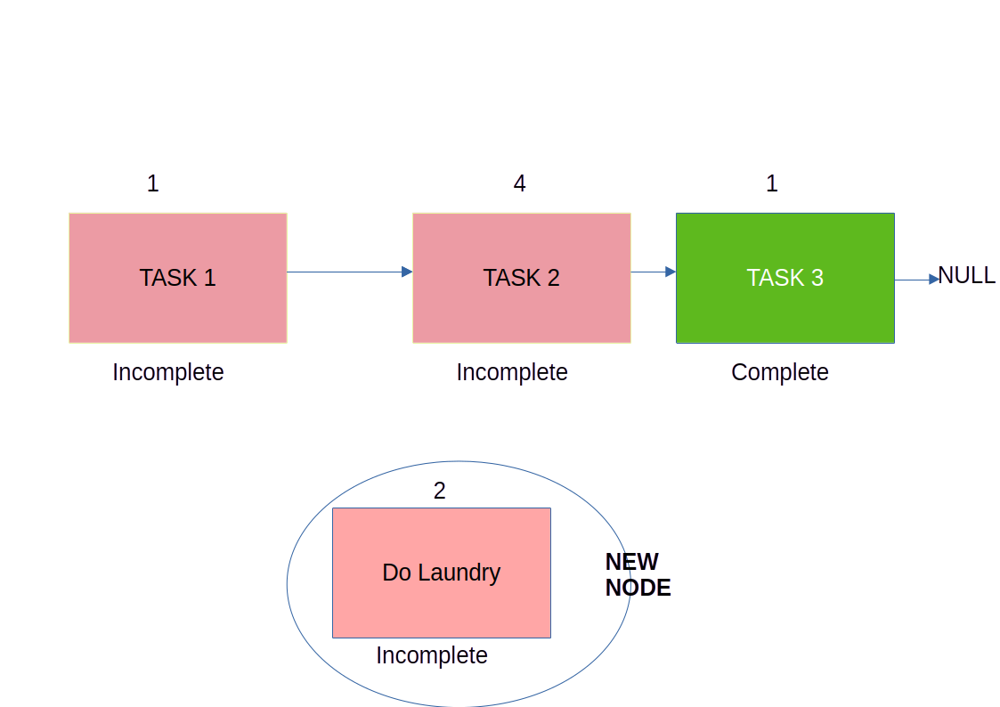
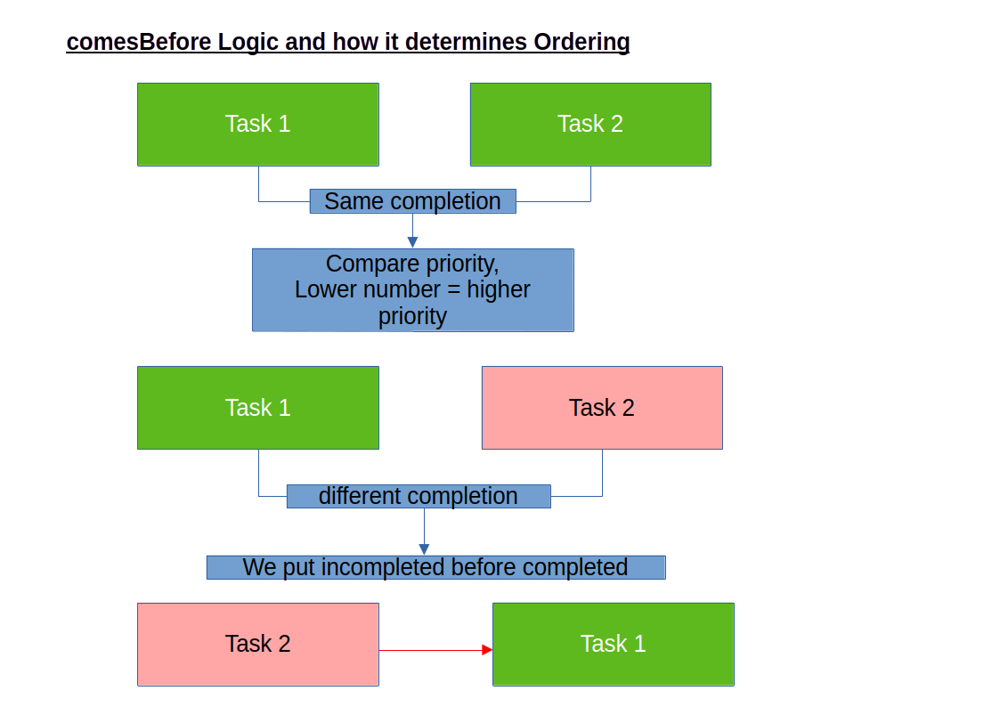
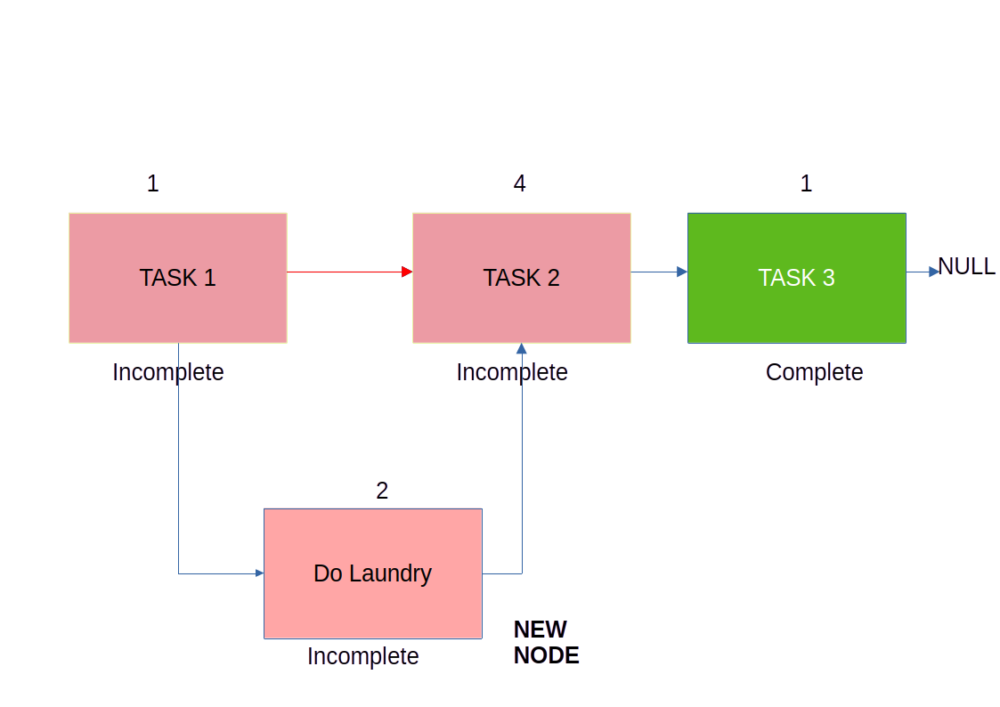
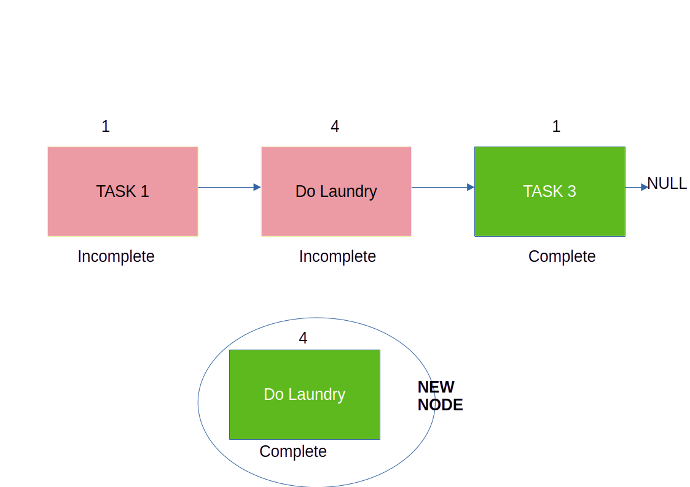
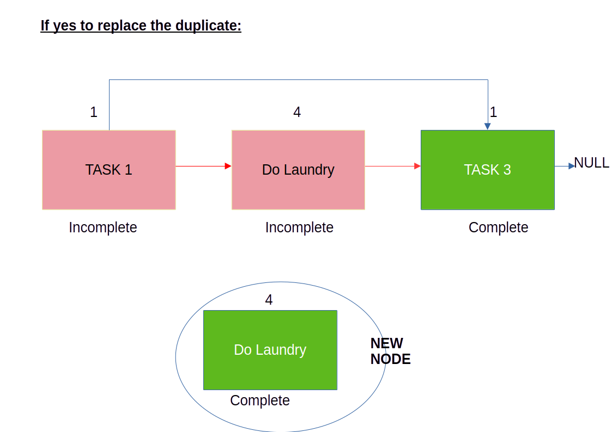
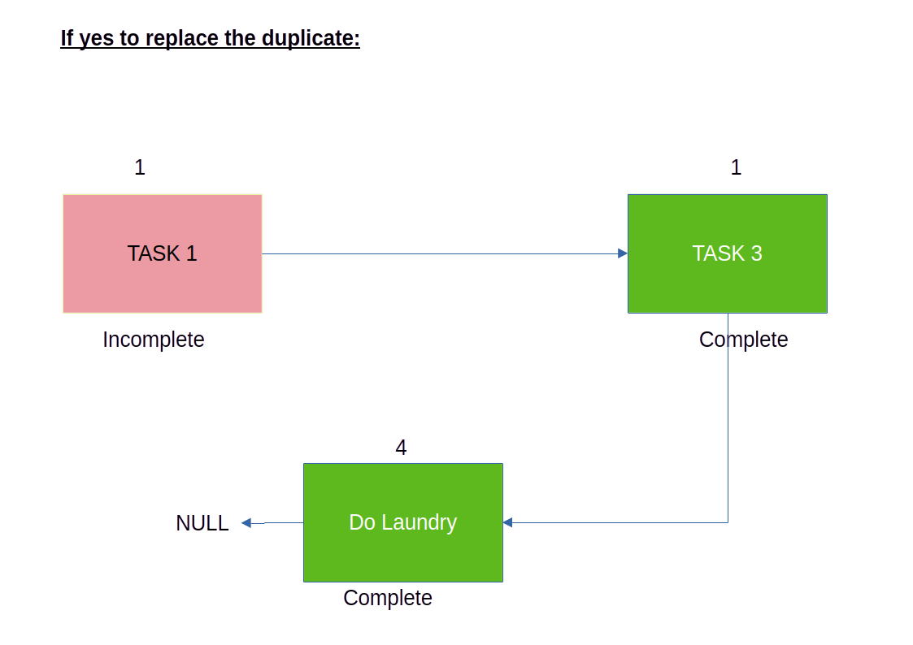

# TODO List Manager (C++ Project)

This project builds a simple command‑line TODO list generator using a custom
**ordered singly linked list**.
Users enter tasks in the format:

The program validates input, stores tasks in sorted order, and outputs a
formatted `output.txt` file.

---

## Features

- Input parsing and validation (task text, yes/no completion, priority 1–5)
- Duplicate detection by task text with interactive replace/skip
- Ordered insertion:
  - Incomplete tasks come **before** completed tasks
  - Within the same completion status, **lower priority number** comes first
- Pretty output file with GitHub‑style checkboxes

## How to Run

From the project root:

```bash
g++ main.cpp -o main
./main
```

## Project Structure
```bash
├── main.cpp
├── validation
│   ├── validation.hpp
│   └── validation.cpp
└── linkedlist
    ├── linkedlist_util.hpp
    ├── linkedlist_util.cpp
    ├── node.hpp
    └── node.cpp
```
# 🧠 High‑Level Flow

1. Read user input until `"exit"`.
2. Parse each line into: (tasks, completed, priority)
3. Validate each field:
    - task must be **non‑empty**
    - completed must be **"yes" or "no"**
    - priority must be **integer in [1, 5]**

4. If a duplicate task text is found:
    - Ask user whether to **replace** or **skip**

5. Insert into an ordered linked list:
    - Incomplete tasks **first**
    - Then ascending **priority**

6. Write `output.txt` with:
    - `- [ ]` for **incomplete** tasks
    - `- [X]` for **completed** tasks


## What Each Part Contains

### **main.cpp**
- Handles user input
- Calls validation functions
- Checks for duplicates and prompts user (replace/skip)
- Inserts items into the ordered linked list
- Writes the final `output.txt`

### **validation.cpp**
- Cleans and trims user input
- Splits lines of the form `"task, yes/no, priority"`
- Validates:
  - task text : non empty string
  - completion flag ("yes"/"no")
  - priority (1–5) valid integer

### **linkedlist_util.cpp**
- Defines the `Node` class
- Implements the `ordered_linkedlist` class using elements from the `Node` class:
  - insert node
  - delete node
  - search for node
  - print into output file

## Example
### **Input**
dishes, no, 3

study, yes, 2

shower, no, 1

exit
### **Output (output.txt)**
[]shower, Priority: 1

[] dishes, Priority: 3

[X] study, Priority: 2

### Ordering Rules

The list is always kept **sorted** using these rules:

1) **Incomplete** tasks come **before** any **completed** tasks.
2) Within the same completion group, sort by **ascending priority** (1, 2, 3, …).

**Decision helper (conceptual):**
```cpp
// returns true if new should come before 'node'
bool comesBefore(bool newCompleted, int newPriority, const Node* node) {
    if (newCompleted != node->isCompleted()) {
        return !newCompleted && node->isCompleted(); // incomplete before complete
    }
    return newPriority < node->GetNodePriority();    // lower number first
}
```
### Duplicate Handling

- A “duplicate” is any new input whose **task text matches** an existing task’s text (case‑sensitive unless otherwise noted in your validator).
- When a duplicate is detected:
  1) The program **shows the existing item** and the **new candidate**,
  2) Prompts: **replace** (delete old, insert new in order) or **skip**.

**Why this design?**
- Tasks are considered unique by their **task text** to keep UX simple.
- Priority/completion may change — replacement lets the user update them without creating two entries with the same name.


**Example (duplicate flow)**

Input:
  - "study, no, 2"
  - "study, yes, 1"  ← duplicate by task text "study"

Prompt:
```bash
INFO: There is a duplicate item in the TODO list. Do you want to replace "study" of priority "2" and "not completed" with "study" of priority : "1" and "completed"? (yes/no)
```
- yes → old "study" removed, new one inserted in order
- no  → skip insertion, keep original

### Ordering Rules

The list is always kept **sorted** using these rules:

1) **Incomplete** tasks come **before** any **completed** tasks.
2) Within the same completion group, sort by **ascending priority** (1, 2, 3, …).

**Decision helper (conceptual):**
```cpp
// returns true if new should come before 'node'
bool comesBefore(bool newCompleted, int newPriority, const Node* node) {
    if (newCompleted != node->isCompleted()) {
        return !newCompleted && node->isCompleted(); // incomplete before complete
    }
    return newPriority < node->GetNodePriority();    // lower number first
}
```
### Insertion Cases

- **Empty list** → new node becomes head.
- **Before head** → if new node should come before current head.
- **Middle** → walk until first spot where new should come before `current->next`.
- **Tail** → if no earlier spot, append to the end.

**Traversal condition (conceptual):**
```cpp
while (current->getNext() && !comesBefore(new, current->getNext())) {
    current = current->getNext();
}
```


<hr style="border: 3px solid black;">



<hr style="border: 3px solid black;">


<hr style="border: 3px solid black;">



<hr style="border: 3px solid black;">



<hr style="border: 3px solid black;">

